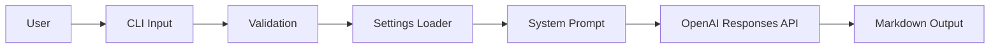
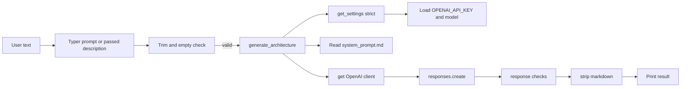

# AI vs Deterministic Boundaries

This document separates what should be explicit, testable, and repeatable from what is still delegated to the LLM.

## Current repo flow

### High level

- The user provides a use case description.
- The CLI validates the input and loads settings.
- The service loads the system prompt and calls the model.
- The model returns the architecture draft as markdown.

### Low level

## Deterministic

These should be explicit code, not model judgment.

- Input validation
- Empty input rejection
- Required field checks
- Default handling
- Environment variable loading
- Prompt file loading
- Output formatting
- File saving
- Error handling
- Word limit enforcement
- Schema or contract validation
- API call orchestration
- Retry and fallback policy
- Logging

## AI-driven

These are reasonable places to let the model reason.

- Architecture pattern selection
- Model selection
- Embedding recommendation
- Vector database recommendation
- Memory strategy
- Risk identification
- Cost assumptions
- Open question generation
- Rejected alternative selection

## Current weakness

Most architectural decisions are currently delegated directly to the LLM through the system prompt.

That makes the tool fast to build, but hard to test. If a prompt changes, architecture choices can shift without a code-level contract noticing.

## Target architecture

Move high-value architectural decisions into explicit reasoning components with testable contracts.

The goal is not to remove the LLM. The goal is to narrow its job to places where judgment is useful and variability is acceptable.

## Proposed split

### Deterministic layer

- Collect and normalize inputs
- Enforce required fields
- Apply defaults
- Validate the output contract
- Write files safely
- Surface errors consistently

### Probabilistic layer

- Interpret the use case
- Recommend patterns and technologies
- Estimate costs from assumptions
- Identify risks and open questions

## Suggested setup

1. Parse user input into a structured request object.
2. Validate required fields before calling the model.
3. Add explicit defaulting for unknown constraints.
4. Have the model fill only the reasoning sections.
5. Validate the response against a markdown contract.
6. Fail closed if the output is missing required sections.

## Practical rule

If a decision can be unit tested, it should be deterministic.

If a decision depends on domain judgment, tradeoffs, or incomplete context, it can stay probabilistic.

## Quick mapping for this repo

| Area | Current state | Recommended boundary |
|---|---|---|
| CLI input | Deterministic | Keep deterministic |
| Settings loading | Deterministic | Keep deterministic |
| Prompt loading | Deterministic | Keep deterministic |
| OpenAI call | Deterministic orchestration | Keep deterministic |
| Architecture choices | LLM-driven | Keep probabilistic for now |
| Output contract | LLM-generated today | Add deterministic validation |

## Next step

Add a small structured request model and an output validator so the repo can enforce the boundary instead of only describing it.
