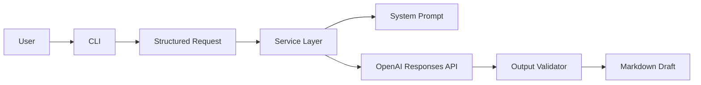

# Architecture Guide

This repo turns a short use case description into a structured architecture draft.

The key design idea is simple:

- deterministic code should validate, normalize, and enforce contracts
- the model should handle judgment-heavy reasoning

## Quick start

Example command with structured inputs:

```bash
architect generate \
  -d "Internal support copilot for policy lookup and ticket triage" \
  --deployment-target Cloud \
  --data-sensitivity Internal \
  --scale Team \
  --approved-stack FastAPI \
  --approved-stack Postgres
```

## High level flow



### What happens

1. The user enters the use case and optional constraints.
2. The CLI normalizes those inputs into a structured request.
3. The service loads settings and the system prompt.
4. The request is serialized into a deterministic prompt payload.
5. The model generates the architecture draft.
6. The output validator checks the required markdown contract.
7. The validated draft is printed back to the user.

## Low level flow

```mermaid
flowchart LR
    U[User text] --> T[Typer input]
    T --> E[Trim and empty check]
    E --> R[ArchitectureRequest]
    R --> P[Prompt serialization]
    P --> L[Load settings]
    L --> O[OpenAI client]
    O --> C[responses.create]
    C --> X[Check response state]
    X --> V[Validate markdown sections]
    V --> Y[Return output]
```



### What is deterministic

- input trimming
- empty input rejection
- enum defaults
- approved stack cleanup
- settings loading
- prompt loading
- API orchestration
- output validation
- file handling

### What is probabilistic

- architecture pattern selection
- model recommendation
- embedding recommendation
- vector database recommendation
- memory strategy
- risk identification
- cost assumptions

## Boundary in code

The current boundary is now enforced in three places:

- [src/ai_system_architect/core/request.py](/Users/sagarika/AI-SYSTEM-ARCHITECT/src/ai_system_architect/core/request.py)
- [src/ai_system_architect/core/validation.py](/Users/sagarika/AI-SYSTEM-ARCHITECT/src/ai_system_architect/core/validation.py)
- [src/ai_system_architect/services/architecture.py](/Users/sagarika/AI-SYSTEM-ARCHITECT/src/ai_system_architect/services/architecture.py)

### Request shape

The request object now carries:

- use case description
- deployment target
- data sensitivity
- scale
- approved stack

That means the model sees a structured prompt payload instead of only a freeform sentence.

### Output contract

The validator currently checks:

- all required sections are present
- the markdown is non-empty
- the Mermaid block exists

If the contract is broken, the app fails closed instead of showing partial output as complete.

## Current weakness

The model still makes the highest-judgment architectural choices.

That is acceptable for now because the goal is to separate:

- what must be repeatable
- what can stay probabilistic

## Target direction

As the repo grows, move more of the following into explicit code:

- schema validation
- section-level output validation
- cost guardrails
- section regeneration
- approved stack filtering

That will make the tool easier to test and easier to trust.
